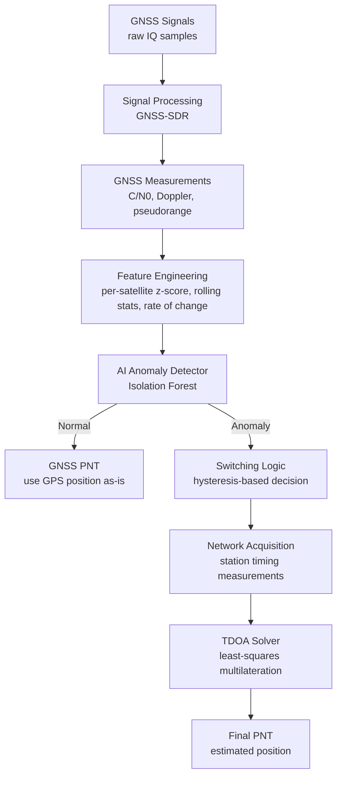

# AI-Network-PNT-Assistant


An AI-based system for detecting GPS spoofing attacks and falling back to network-based
Positioning, Navigation & Timing (PNT) when GPS readings are compromised.

---

## Table of Contents

- [Overview](#overview)
- [System Architecture](#system-architecture)
- [Dataset](#dataset)
- [Detection Model](#detection-model)
- [Model Development Journey](#model-development-journey)
- [Results](#results)
- [Known Limitations](#known-limitations)
- [Project Structure](#project-structure)
- [Getting Started](#getting-started)
- [Testing](#testing)
- [References](#references)

---

## Overview

GPS spoofing is an attack in which a malicious actor broadcasts counterfeit GPS signals to
deceive a receiver into computing a false position, velocity, or time. This project addresses
that threat with a three-stage pipeline:

1. **Detection** — an unsupervised anomaly detection model continuously evaluates incoming
   GPS observables (signal strength, Doppler shift) and flags readings that deviate from
   learned normal behavior.
2. **Switching Logic** — a hysteresis-based decision engine determines whether to trust GPS
   or fall back to an alternative positioning source, avoiding rapid flip-flopping on
   borderline detections.
3. **PNT Engine** — classical multilateration mathematics (TDOA / trilateration, optionally
   smoothed with a Kalman filter) computes position from network-based timing measurements
   when GPS is deemed unreliable.

The system is designed so that each stage can be developed, tested, and validated
independently of physical hardware, using recorded reference data as a stand-in until a
physical station (PC + USRP) becomes available.

---

## System Architecture

### High-level data flow

```
                    GNSS Signals
                         │
                         ▼
                 Signal Processing
                         │
                         ▼
                GNSS Measurements
                         │
                         ▼
                Feature Engineering
                         │
                         ▼
                AI Anomaly Detector
                         │
                   ┌─────┴─────┐
                   │           │
                Normal       Anomaly
                   │           │
                   ▼           ▼
              GNSS PNT    Switching Logic
                               │
                               ▼
                         Network PNT
                               │
                               ▼
                         TDOA Solver
                               │
                               ▼
                          Final PNT
```

### Detailed pipeline (module-level)



**Design principle:** every stage that depends on hardware not yet available (USRP, physical
network stations) is implemented behind a factory interface (`source_factory.py`,
`station_source_factory.py`) with a working mock/file-based implementation today and a
documented placeholder for the real one. Switching to real hardware later requires a
one-line config change, not a code rewrite.

### Module ↔ pipeline stage mapping

| Pipeline stage | Source code |
|---|---|
| GNSS Signals | `src/signal_acquisition/` (`file_source.py` today, `usrp_source.py` pending hardware) |
| Signal Processing | `src/gnss_processing/` (`observable_parser.py`, GNSS-SDR integration) |
| GNSS Measurements | Raw `channel`/`navsol` observables (C/N0, Doppler, pseudorange, TXID) |
| Feature Engineering | `src/feature_engineering/` (`satellite_baseline.py`, `rolling_features.py`, `feature_pipeline.py`) |
| AI Anomaly Detector | `src/detection_model/` (`model.py`, `train.py`, `predict.py`) |
| Switching Logic | `src/switching_logic/decision_engine.py` |
| Network PNT / TDOA Solver | `src/network_acquisition/` + `src/pnt_engine/` (`tdoa.py`, `trilateration.py`, `kalman_filter.py`) |
| Final PNT | Output of `main.py`'s end-to-end loop |

---

## Dataset

The detection model is trained and evaluated on **TEXBAT** (Texas Spoofing Test Battery), a
publicly available dataset from the University of Texas at Austin Radionavigation Laboratory.
Unlike purely simulated datasets, TEXBAT combines a genuine recorded GPS signal with realistic
spoofing signals generated using real spoofing hardware, making it substantially more
representative of real-world conditions.

Four scenarios were used:

| Scenario | Description | Attack onset (verified) |
|---|---|---|
| `cleanStatic` | No attack, static receiver | N/A (fully clean) |
| `ds2` | Abrupt time-push attack | Second 477992 (confirmed via C/N0 jump analysis, agreement across satellites) |
| `ds3` | Gradual power-increase attack | Second 478001 (confirmed via C/N0 slope + jump analysis) |
| `ds7` | Power-matched, phase-aligned attack (hardest to detect) | Second 478036 (from official TEXBAT documentation; not independently verifiable from the data itself) |

Ground truth (ds2/ds3) was established through direct visual and statistical analysis of C/N0
and Doppler shift, rather than relying on the receiver's own internal spoofing-detection flag
— that flag was found to fail on every attack scenario tested, underscoring the need for a
supplementary detection layer, which is the core motivation for this project.

---

## Detection Model

**Approach:** unsupervised anomaly detection (Isolation Forest), trained exclusively on
normal (unspoofed) readings. This means the model learns what "normal" looks like rather than
memorizing known attack signatures, giving it a chance to generalize to attack types not seen
during training.

**Final feature set:**

| Feature | Purpose |
|---|---|
| `cn0_zscore_per_satellite` | C/N0 normalized against each satellite's own baseline mean/std (computed from training data only) |
| `cn0_rolling_std` | Local signal volatility |
| `cn0_diff` | Rate of change (captures sudden jumps) |
| `doppler_rolling_std` | Local Doppler volatility |
| `doppler_diff` | Doppler rate of change |

**Threshold selection:** rather than guessing the Isolation Forest's `contamination`
parameter, the decision threshold is calibrated from the percentile distribution of anomaly
scores on the normal training data itself. Percentile 20 was selected as the operating point
after testing a range of values.

---

## Model Development Journey

The path to the final model involved several iterations, each driven by a specific diagnostic
finding:

1. **v1 — raw features (C/N0, Doppler + rolling stats):** Recall = 0.17. Nearly all attacks
   missed.
2. **Threshold tuning alone:** best achievable recall was 0.53 — indicating the problem was
   not threshold calibration.
3. **Per-scenario breakdown:** identical recall (0.17) on both ds2 and ds3, despite ds2
   showing much cleaner visual separation — pointed to a shared underlying issue.
4. **Root cause found:** different satellites have very different natural C/N0 baselines
   (ranging from ~36 to ~53 dB-Hz depending on signal strength/elevation). Raw C/N0 caused
   the model to confuse "naturally weak satellite" with "anomalous satellite."
5. **v2 — removed raw values, kept only relative features:** recall stayed at 0.17. This
   revealed that ds2's attack causes a brief jump followed by a long stable period at a new,
   abnormal level — relative features alone only catch the jump itself, not the sustained
   shift.
6. **v3 — per-satellite z-score for C/N0:** recall jumped to 0.33, confirming normalization
   (not removal) of the absolute value was the correct fix.
7. **Doppler z-score tested and dropped:** no improvement, since Doppler naturally drifts
   continuously due to real satellite motion, making a fixed baseline mean meaningless for it.
8. **v4 — final feature set + percentile-based threshold tuning:** recall improved from 0.33
   (percentile 5) to 0.91 (percentile 20), with precision holding at 0.94.

**Key lesson:** the single biggest improvement came from correctly framing what "normal"
means *per satellite*, not from a more complex model or more data.

---

## Results

### On training-distribution scenarios (ds2 + ds3)

| Metric | Value |
|---|---|
| Overall Recall | 0.91 |
| Overall Precision | 0.94 |
| ds2 Recall | 1.00 |
| ds3 Recall | 0.82 |

### On ds7 (excluded from training — out-of-distribution test)

| Metric | Value |
|---|---|
| Recall | 0.58 |
| Precision | 0.84 |
| False positive rate on ds7's own normal segment | 25.9% (vs. 19.9% on ds2/ds3) |

The moderate false-positive gap (rather than a rate close to the 58% recall) indicates the
model captures a genuine partial signal in ds7 rather than simply flagging the entire
recording as anomalous — a more nuanced outcome than the near-zero detection rates reported
by some prior work using different detection strategies.

### End-to-end pipeline validation

The full pipeline (signal source → features → detection → switching → PNT calculation) was
run against a real, labeled TEXBAT file (`ds2`) through `main.py`. Detection results matched
the notebook exactly (recall 1.00 on this file), and the switching logic correctly triggered
network-based position calculation during the labeled attack period. The TDOA position solver
was independently verified with a synthetic test recovering a known position to 0.0 m error.

---

## Known Limitations

1. **ds7-type attacks are only partially detectable** with C/N0/Doppler-based features alone.
   Reliable detection would likely require additional signal-level features (e.g. raw
   correlator outputs) not available from summary observables.

2. **Calibration gap between TEXBAT's reference receiver and GNSS-SDR.** When the trained
   model was applied to observables extracted independently via GNSS-SDR from a short (~5 s)
   raw IQ snippet of the same `cleanStatic` recording, it produced a 100% false-positive rate.
   Diagnosis showed:
   - Only 8 of 14 training-set satellites were acquired in the short snippet (likely due to
     acquisition time being too short for weaker signals, not a fundamental incompatibility).
   - C/N0 offsets relative to the training baseline varied substantially and non-uniformly
     across satellites (z-score −0.5 to −3.7 for most satellites; −16.3 for one weak-signal
     satellite), consistent with known differences in tracking-loop performance between a
     professional hardware receiver (GRID, used to produce TEXBAT's reference data) and a
     software-defined receiver (GNSS-SDR).
   - This is documented as an open finding rather than resolved: the appropriate fix is
     likely retraining/recalibrating baselines directly from live GNSS-SDR (or eventual
     USRP) data rather than reusing TEXBAT-derived baselines, but this was not carried out
     as part of the current scope.

3. **Network-based PNT is validated mathematically but not against real station data.**
   `tdoa.py` was verified against a synthetic ground-truth position (0.0 m error) and is
   exercised end-to-end via a mock station source. It has not yet been tested against real
   multi-station timing measurements (e.g. real or open TDOA/multilateration datasets), which
   is noted as future work rather than a current requirement.

4. **No real-time streaming or hardware integration yet.** The current pipeline runs in
   batch/offline mode against recorded files. `usrp_source.py` and `real_station_source.py`
   are documented placeholders pending physical hardware.

---

## Project Structure

```
AI-Network-PNT-Assistant/
├── configs/
│   ├── config.yaml                  # main configuration (signal source, model, switching, PNT)
│   └── usrp_config.yaml             # USRP hardware settings (placeholder until hardware available)
│
├── data/                            # recorded/reference data and GNSS-SDR outputs
│
├── models/                          # trained model artifacts
│   ├── detector.pkl
│   ├── scaler.pkl
│   ├── threshold.txt
│   └── satellite_baselines.csv
│
├── notebooks/
│   └── Network_PNT.ipynb            # full exploratory analysis and model development history
│
├── src/
│   ├── signal_acquisition/          # GPS signal source (file-based today, USRP later)
│   │   ├── file_source.py
│   │   ├── usrp_source.py           # placeholder - requires physical hardware
│   │   └── source_factory.py
│   │
│   ├── network_acquisition/         # network station timing source (mock today, real later)
│   │   ├── mock_station_source.py
│   │   ├── real_station_source.py   # placeholder - requires physical stations
│   │   └── station_source_factory.py
│   │
│   ├── gnss_processing/             # raw IQ -> observables (GNSS-SDR integration)
│   │   ├── gnss_sdr_config/
│   │   │   └── default.conf         # GNSS-SDR configuration used for raw signal testing
│   │   ├── gnss_sdr_runner.py       # placeholder - GNSS-SDR currently run manually via CLI
│   │   ├── observable_parser.py     # parses GNSS-SDR tracking output into model-ready schema
│   │   └── run_pipeline.py          # glue script: parser -> feature_pipeline -> feature matrix
│   │
│   ├── feature_engineering/
│   │   ├── satellite_baseline.py    # per-satellite baseline computation/loading
│   │   ├── rolling_features.py      # rolling mean/std, rate of change
│   │   └── feature_pipeline.py      # single source of truth for feature construction
│   │
│   ├── detection_model/
│   │   ├── model.py                 # GPSAnomalyDetector (Isolation Forest + calibrated threshold)
│   │   ├── train.py
│   │   └── predict.py
│   │
│   ├── switching_logic/
│   │   └── decision_engine.py       # hysteresis-based GPS/network decision
│   │
│   └── pnt_engine/
│       ├── tdoa.py                  # verified against synthetic ground truth (0.0 m error)
│       ├── trilateration.py
│       └── kalman_filter.py
│
├── tests/
├── main.py                          # end-to-end entry point
└── requirements.txt
```

---

## Getting Started

```bash
# 1. Install dependencies
pip install -r requirements.txt

# 2. Train the detection model (uses cleanStatic + ds2 + ds3; ds7 excluded by design)
python -m src.detection_model.train --data data/combined_labeled.csv

# 3. Run the full pipeline against a recorded file
python main.py
```

Configuration (signal source, model directory, switching sensitivity, PNT method) is
controlled entirely through `configs/config.yaml` — no code changes are needed to point the
pipeline at a different input file or adjust the switching hysteresis window.

---

## Testing

```bash
# Unit test: switching logic behavior in isolation
python -m tests.test_switching_logic

# Unit test: TDOA math correctness against a known synthetic position
python -m tests.test_network_acquisition

# Integration sanity check: reproduce notebook-reported metrics on the combined dataset
python -m tests.test_with_recorded_file

# Integration check: scenario-specific reproduction of notebook's ds2 result (recall = 1.00)
python -m tests.test_full_pipeline_on_texbat
```

> **Note on `test_with_recorded_file.py`:** this test evaluates the trained model on the same
> normal data it was trained on (not a held-out split like the notebook used), so its
> "Normal recall" is mechanically close to `1 - threshold_percentile/100` by definition of the
> percentile threshold. It verifies pipeline mechanics reproduce correctly, not generalization
> performance — the notebook's held-out evaluation (91% recall / 94% precision) remains the
> authoritative generalization metric.


---

## References

- Humphreys, T. E. et al. — TEXBAT: Texas Spoofing Test Battery, University of Texas at
  Austin Radionavigation Laboratory
- GNSS-SDR — open-source GNSS software-defined receiver, [gnss-sdr.org](https://gnss-sdr.org)
- scikit-learn IsolationForest documentation
